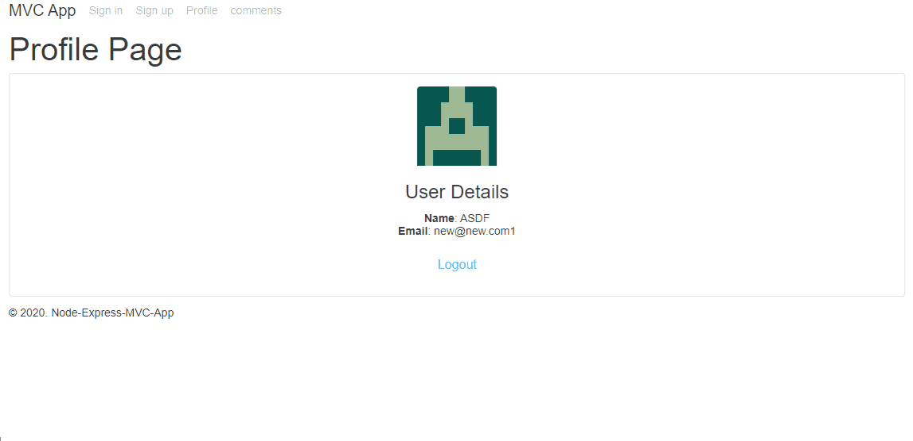

## Twitter style Web Application w/ MVC Design Pattern



Lessons

- NodeJS and ExpressJS
- MVC Design Pattern
- Yeoman generator
- Express generator
- Express template engine
- User Authentication
- Mongoose Schema & MongoDB

<br/>

### Yeoman generator

- https://yeoman.io/
- generic scaffolding system
- rapid creation of apps
- streamline maintenance of existing projects

<br/>

### Middleware

- How Express handles a sequence of functions

  - ```javascript
    app.get()
    app.get()
    app.use(SOME FUNC)
    app.post()
    ```

- **Series of functions** that can be called
- On every single **REQUEST** these series of functions will be executed

- `(req, res, next)`

<br/>

### Generate with express-generator

- type `express --ejs --css sass --git`
- modify package.json

  - add "description", "license"m "author", "repository", "keywords"

- `npm i`
  - install dependencies

<br/>

### Modify Application Structure

= refactoring

- modify the directory structure to follow MVC pattern

  - create `server/`
  - put `config/`, `routes/`, `views/` in them

- modify basic behaviors, and start the application

  - ```javascript
    app.set("port", process.env.PORT || 3000);
    ```

<br/>

### Modify views/ Directory with Partials

- reusable componenets = partials

- created partials

  - header
  - footer
  - javascript
  - stylesheet

- apply partials to pages/

<br/>

### Add Sign in, Sign up, Profile Templates

- error flash messages are at the top of each body

<br/>

### Install Additional Middlewares

- `connect-flash`: outputs user friendly messages
- `connect-mongo`: driver that connects with mongoDB
- `mongoose`: mongoose ODM
- `express-session`: save user sessions to DB
- `gravatar`: show random user avatars
- `bcrypt-nodejs`: encrypt password module
- `passport`: authentication middleware
- `passport-local`: local user/password authentication

<br/>

### Refactoring app.js with new Middlewares

- app.js
  - Database Configuration
  - Passport
  - save session to DB

<br/>

### Add config.js & passport.js

- process.nextTick()

  - To schedule a callback function to be invoked in the next iteration of the Event Loop

  - > The difference between setTimeout() and process.nextTick() is that the process.nextTick() function is **specific to the Node.js Event Loop**. setTimeout() uses JavaScript runtime to schedule its own queue of events. When using process.nextTick(), callback function associated with it runs immediately after events in the Event Queue are processed by the Event Loop in a single iteration. In comparison to setTimeout(), it is faster since queue associated with setTimeout() or the JavaScript runtime.

  - https://gist.github.com/mmalecki/1257394

- syntax

  - ```javascript
    passport.use(
      new LocalStrategy(function (username, password, done) {
        User.findOne({ username: username }, function (err, user) {
          if (err) {
            return done(err);
          }
          if (!user) {
            return done(null, false);
          }
          if (!user.verifyPassword(password)) {
            return done(null, false);
          }
          return done(null, user);
        });
      })
    );
    ```

- why use process.nextTick()?

  - show that async authentication is possible.
  - querying a DB = async in nature

<br/>

### Create models/ & add user Schema

<br/>

### Protect Routes

- create isLoggedIn() to check if use is authenticated

<br/>

### Create controllers/

- separate router and controller
- create comments.js
  - state three methods
    - .list
    - .create
    - .hasAuthorization
- create modal for comments

  - `<form>`: set where to put

- `data-toggle` & `data-target` = in bootstrap
- ejs syntax
  - inject JS with `<%`
  - say the tag is equal to `<%=`
